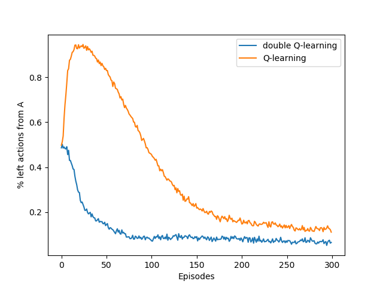
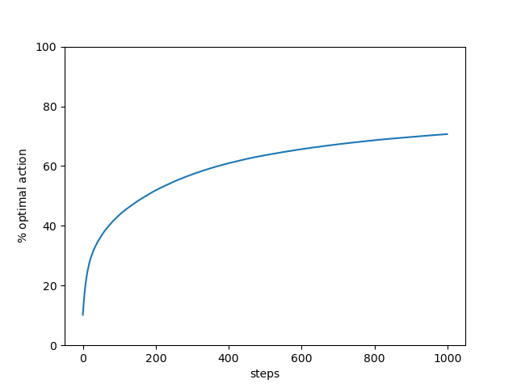

# Some reinforcement learning algorithms

Implementations of basic reinforcement learning algorithm in discrete spaces. Tile coding is used for a bounded small state space.

* First visit MC and Sarsa on toy model
* Double Q-learning Vs Q-leaning in stochastic environment. The code gives the chart from Sutton's reinforcement learning book. In this environment, the best initial action is right. But in stochastic environment, Q-learning may be "fooled by randomness" and it chooses the action left at least for the first 100 episodes. In contrast, double Q-learning is faster to converge.

* Tile coding. The code solves the MountainCar-v0 environment from [Open Ai Gym](https://gym.openai.com/). After the training, the agent generally solves the problem in "3 moves": right, left, right. In Q-learning with discretized state space, the solution comes in 4 moves (generally, the car bounces against the left boundary). The discretization of the state space is inpired by [
        deep-reinforcement-learning/tile-coding/Tile_Coding.ipynb
      ](https://github.com/udacity/deep-reinforcement-learning/blob/master/tile-coding/Tile_Coding.ipynb)

* Simple k-bandit problem with k=10. The data are averages of 2000 different bandit problems. The algorithm is epsilon greedy with epsilon in {0, 0.01 , 0.1}. In this case, exploiting all the time (i.e. epsilon=0) is not the optimal solution.

