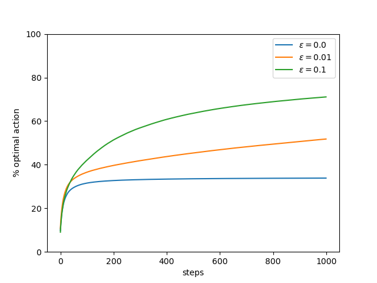

# Some reinforcement learning algorithms

Implementations of basic reinforcement learning algorithm in discrete spaces. Tile coding is used for a bounded small state space.

* First visit MC and Sarsa on toy model
* Double Q-learning Vs Q-learning in stochastic environment. The code gives the chart from Sutton's reinforcement learning book. In this environment, the best initial action is right. But in stochastic environment, Q-learning may be "fooled by randomness" and it chooses the action left at least for the first 100 episodes. In contrast, double Q-learning is faster to converge.

* Tile coding. The code solves the MountainCar-v0 environment from [Open Ai Gym](https://gym.openai.com/). After the training, the agent generally solves the problem in "3 moves": right, left, right. In Q-learning with discretized state space, the solution comes in 4 moves (generally, the car bounces against the left boundary). The discretization of the state space is inpired by [
        deep-reinforcement-learning/tile-coding/Tile_Coding.ipynb
      ](https://github.com/udacity/deep-reinforcement-learning/blob/master/tile-coding/Tile_Coding.ipynb)

* Simple k-bandit problem with k=10. The data are averages of 2000 different bandit problems. The algorithm is epsilon greedy with epsilon in {0, 0.01 , 0.1}. In this case, exploiting all the time (i.e. epsilon=0) is not the optimal solution. See Sutton&Barto chap.2 for details on the trade-off explore/exploit on the k-bandit problem.

* Optimistic initial values. The idea is to "disappoint" the agent at the beginning in order to promote exploration (since any action will decrease the estimate Q(a) of that action, while the value of an unexplored action still remains high). Below, a plot that shows that even with epsilon=0 (i.e. always greedy, meaning always exploiting), the algorithm does enough exploration to "beat" the greedy ones without "optimistic initial values". This plot can be optained by modifying the bandit algorithm. The update step is now \alpha = 0.1 (instead of 1/N(a)). The plot shows the average of 2000 k-bandit problems with k=10.

* Upper-confidence-bound action selection. See Sutton section 2.7. In the k-armed bandit problem, UCB action selection performs well in this type of problems (here, better than an epsilon-greedy action selection). The plot shows the average of 2000 k-bandit problems with k=10.

* Dyna-Q on gym's CliffWalking-v0 environment. Q-learning is used for planning and learning. The environment is 'solved' if average of last 100 episodes is at least -13.0 (optimal). Without planning, it takes 450 episodes, with a 50 step planning, it can be solved on average with 180 episodes. (TO DO: clean the code + graphics)
